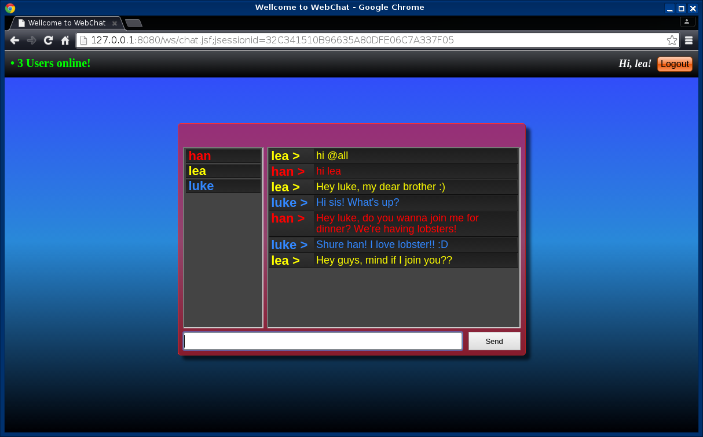

# WebChat
Java III Project: Simple WebChat using JavaEE-WebSockets

## Some Notes

* This is free and open software developed for **research and educational** purposes only
* Client Server Architecture
* User registration using JSF 2.2, Hibernate/HSQLdb Database
* Secure password store (salted and hashed)
* Chat Msg. transport via WebSockets/Gson
* Tested on Apache Tomcat/8.0.15 Application Server

## Screenshot

